# 沿磁力線制御の成立性

本稿は，公開用の日次HKと軌道要素から，KASHIWA，SAKURA，YOMOGI，BOTANの沿磁力線制御が成立しているかを検証するものである．沿磁力線制御とは，永久磁石で衛星の一軸を地磁気の磁力線に沿わせる受動的な姿勢制御である．終了措置申請書によれば，4衛星は磁力線を軸として回転し，その衛星軸はZ軸である．したがって本稿は「Z軸が磁力線に沿い，Z軸まわりに回転している」を作業仮説とし，日次HKの外面パネル温度で検証する．

外面の構成は次のとおりである．+X面はアンテナを取り付けたFR4基板であり，太陽電池を持たない．HKの太陽電池チャンネルも-X，±Y，±Zの5面だけである．KASHIWA，SAKURA，YOMOGIは残る5面にトリプルジャンクション太陽電池を貼る．BOTANは+Z面だけがCIGS太陽電池であり，本稿はそのほかの面を前3機と同じ構成と仮定する．BOTANのHKにはCIGS太陽電池の温度も含まれる．+X面の温度センサは他の5面と換算式が異なるリニア型であり，SAKURAとYOMOGIの+X面温度の固定偏差はこのセンサ系統に起因する可能性がある．

## 結論

4衛星とも沿磁力線制御は成立している．日次中央値では±Z面の温度差がβ角に同期し，生HKでは軌道内で磁力線方向に1軌道2回追従する変調が確認できた．姿勢が整定するまでには2–3週間を要した．要点は次の8つである．

1. ±Z面の温度差は，磁力線モデルが予測する太陽入射差と有意に相関する．相関係数の絶対値は0.62–0.78，p値は10⁻¹¹以下である．
2. 温度差の感度は0.032–0.045 °C/(W/m²)で，4機とも同程度である．号機間で姿勢挙動が大きく異なる証拠はない．
3. ±X面と±Y面の日別中央値は互いに数 °C以内に収まる．Z軸まわりの回転で側面の入射が平均化されているという解釈と整合する．例外はSAKURAとYOMOGIの+X面で，いずれもアンテナ面の温度センサ系統の問題が疑われる．
4. 極性は，KASHIWAとYOMOGIが+Z面を磁力線方向（+B̂）に，SAKURAとBOTANが+Z面を磁力線の逆方向（−B̂）に向けている．磁力線方向を向く面は永久磁石のN極側であるから，KASHIWAとYOMOGIは+Z面がN極，SAKURAとBOTANは+Z面がS極である．磁石の軸がZ軸である点は4機で共通であり，N/Sの向きだけが号機で異なる．
5. 日次の入射差はsin βとの相関が0.97以上であり，日次データだけでは磁力線仮説と軌道面法線仮説を区別できない．そこで生HK（90秒周期）で軌道内の変化を調べたところ，4機とも ΔT_Z が磁力線方向 B̂ と太陽方向の内積に1軌道2回の周期で追従した．日別相関の中央値は絶対値で0.70–0.89である．この変調は軌道面法線仮説では生じないため，磁力線仮説が確定する．
6. 姿勢が安定するまでの時間は2段階で評価した．Z軸が平均として磁力線を向く「捕捉」は，YOMOGIで3日目，SAKURAとBOTANで放出当日から確認できる．揺動が収まりZ面の明暗切替が2回/軌道以下になる「整定」は，YOMOGIで12–17日目，SAKURAで22–24日目，KASHIWAで14–24日目の間である．揺動の指数減衰の時定数は6–13日で，放出後19–35日で収束した．BOTANは11–13日目にZ軸が磁力線に対して180°反転し，その後は安定した．
7. 高速HKのスピン解析では，SAKURAとKASHIWAのZ軸まわりの回転速度は約23秒周期，すなわち15–16 °/sで，運用チームが画像から求めた値と一致する．
8. 食中の冷却率から ε を，定常の α/ε と組み合わせて α を分離した．側面の ε は熱容量45 J/Kの仮定で0.61–0.71，α は0.51–0.61である．熱容量に比例する量であるため，絶対値には±30%程度の不確かさがある．

## 手法

### β角

β角とは，太陽方向と軌道面のなす角である．β角が大きいほど食時間が短く，軌道面法線に近い面ほど太陽を向く．β角は軌道傾斜角，昇交点赤経，太陽の赤経・赤緯から次式で求めた．

sin β = cos δ sin i sin(Ω − α) + sin δ cos i

ここで i は軌道傾斜角，Ω は昇交点赤経，α と δ は太陽の赤経と赤緯である．軌道傾斜角と昇交点赤経は，`data/recorded/<衛星>/tle.csv`（地上局DBと運用ログに残る二行軌道要素（two-line element: TLE）の取得履歴）から重複を除いて取り出した．TLEの件数が号機で大きく異なるため（KASHIWA 4件，SAKURA 123件，YOMOGI 182件，BOTAN 237件），昇交点赤経は次の方針で補った．

1. TLEが存在する期間は，TLEの値を線形補間する．
2. TLEの外側の期間は，最寄りのTLEを起点にJ2摂動による歳差を数値積分する．半長径は `orbit.csv` の遠地点・近地点高度の平均を用いる．

積分の妥当性は，最初のTLEから最後のTLEまで積分したときの昇交点赤経の閉合誤差で確認した．KASHIWAは51日間で-0.07°，SAKURAは84日間で-0.10°，YOMOGIは107日間で+1.24°，BOTANは137日間で-0.14°である．β角の1°の誤差は温度との相関に影響しない．YOMOGIのβ角は運用チームの計算値とも照合し，95日間で差の平均0.26°，二乗平均平方根1.9°であった．

### 姿勢モデルと各面の入射量

各日について1日分の軌道を円軌道で生成し，各面の軌道平均入射量を求めた．太陽方向は天文年鑑の低精度式，地磁気はIGRF-13，食は円筒影で計算した．姿勢仮説の下で，各面の太陽入射は次のようになる．

- ±Z面: 太陽方向単位ベクトル ŝ と磁力線方向単位ベクトル B̂ の内積を用い，max(0, ±ŝ·B̂) に比例する．
- 側面（±X，±Y）: Z軸まわりの回転で平均化され，√(1 − (ŝ·B̂)²)/π に比例する．

アルベドと地球赤外は，平板から地球への形態係数を数値積分して加えた．以上の値は `data/derived/<衛星>/beta_daily.csv` に収録した．

### 検定量

主な検定量は，+Z面と-Z面の日別中央値の差 ΔT_Z である．磁力線モデルはこの差が入射差 A_B = q(+B̂) − q(−B̂) に比例すると予測する．ΔT_Z を A_B に線形回帰し，傾き，相関係数，p値を求めた．対立仮説として，次の3つも同じデータに当てはめた．

- 慣性空間に固定した回転軸: ΔT_Z が日照中の平均太陽方向の3成分に線形従属する．
- 軌道面法線に沿う回転軸: ΔT_Z が sin β に比例する．
- 姿勢と無関係な回転（タンブリング）: ΔT_Z がβ角と無相関で，平均が0に近い．

側面の検定量は，+X面と-X面の差 ΔT_X，+Y面と-Y面の差 ΔT_Y，および4側面の最大差である．Z軸まわりの回転が成立していれば，これらはΔT_Zより小さい．

### 有効α/ε

面ごとの太陽光吸収率 α と赤外放射率 ε の比を，一面平板の放射平衡から求めた．平板の温度を日別中央値，入射量を軌道平均とすると，次式となる．

α/ε = (σT⁴ − q_IR F) / (S q_sun + a S q_alb)

ここで S は太陽定数1361 W/m²，a はアルベド0.30，q_IR は地球赤外237 W/m²，F は地球への形態係数である．面間の熱伝導と内部発熱を無視するため，得られる値は有効値である．参考として，6面が等温の立方体とみなした衛星全体の α/ε も求めた．

## 結果

### β角と日照率

4衛星のβ角は約60日周期で変化し，運用中に1.5–2周期を経た．図中の日照率は，β角の絶対値が約70°を超える期間に100%へ達する．

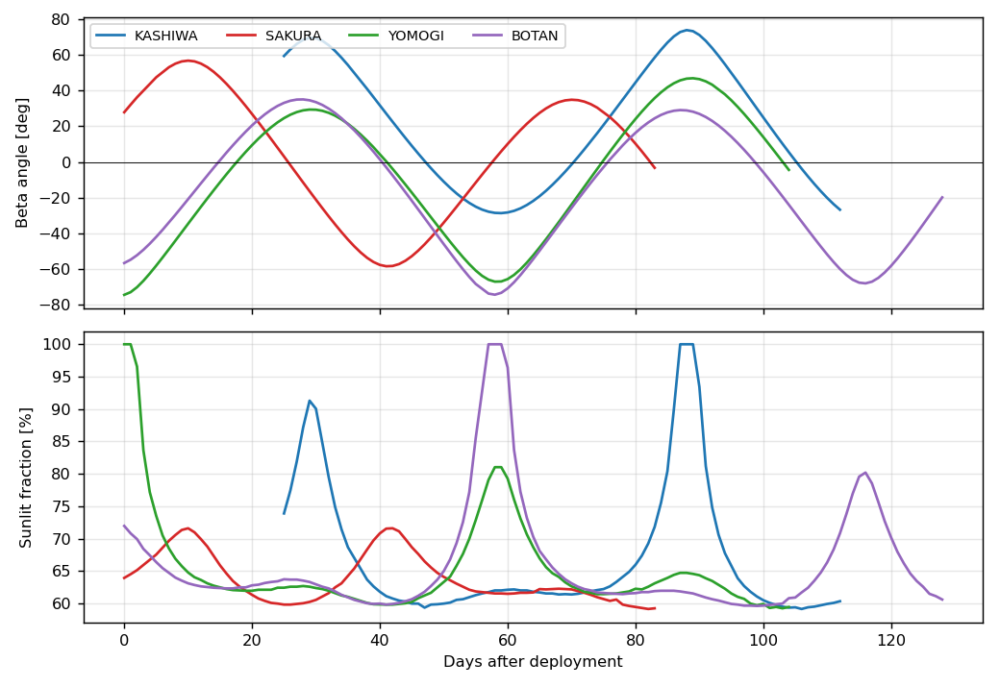

| 衛星 | 日数 | TLE件数 | β角の範囲 | 日照率の範囲 | 全日照の期間 |
|---|---:|---:|---:|---:|---|
| KASHIWA | 83 | 4 | -28.6° – +73.8° | 59.2 – 100% | 87–89日目 |
| SAKURA | 80 | 123 | -58.3° – +56.8° | 59.2 – 71.6% | なし |
| YOMOGI | 102 | 182 | -74.3° – +46.9° | 59.3 – 100% | 0–1日目 |
| BOTAN | 122 | 237 | -74.2° – +35.1° | 59.6 – 100% | 57–59日目 |

### ±Z面の温度差

±Z面の温度差は，4衛星とも磁力線モデルの入射差に追従する．図の破線はモデルの回帰直線，灰色の細線はβ角である．

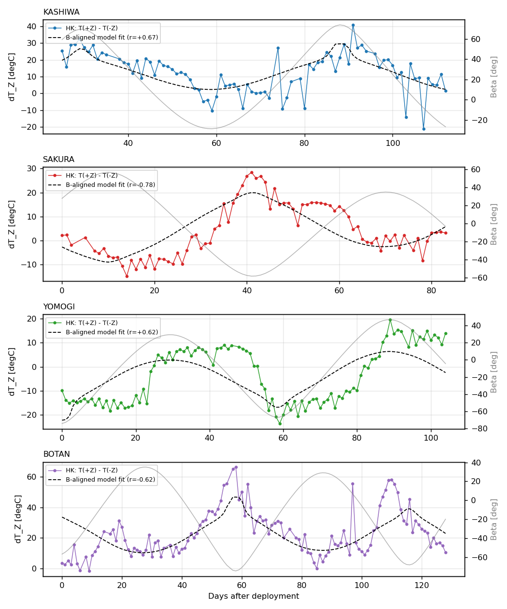

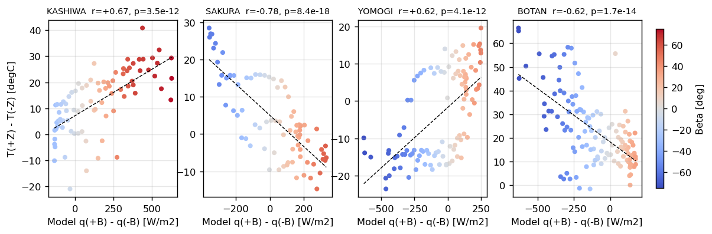

| 衛星 | 傾き k [°C/(W/m²)] | 切片 [°C] | 相関係数 r | R² | p値 | 極性 |
|---|---:|---:|---:|---:|---:|---|
| KASHIWA | +0.036 ± 0.004 | +7.2 | +0.67 | 0.45 | 4.6×10⁻¹² | +Z → +B̂ |
| SAKURA | -0.042 ± 0.004 | +5.0 | -0.78 | 0.61 | 8.5×10⁻¹⁸ | +Z → -B̂ |
| YOMOGI | +0.032 ± 0.004 | -1.8 | +0.62 | 0.38 | 4.1×10⁻¹² | +Z → +B̂ |
| BOTAN | -0.045 ± 0.005 | +18.3 | -0.62 | 0.39 | 2.0×10⁻¹⁴ | +Z → -B̂ |

傾きの絶対値は4機で0.032–0.045 °C/(W/m²)に収まる．孤立した平板の感度 1/(4εσT³) は約0.23 °C/(W/m²)であるため，観測値はその15–20%である．この差は1U筐体の面間熱伝導で説明でき，姿勢制御の不成立を示すものではない．切片はモデル入射差が0のときの±Z面温度差である．BOTANの+18 °Cは，後述のとおり+Z面のCIGS太陽電池の温度を反映する．KASHIWAの+7 °Cは，内部発熱の偏りまたはセンサのオフセットを示す．

対立仮説の当てはまりを次に示す．軌道面法線仮説の R² は磁力線仮説とほぼ等しい．これは，日次平均した入射差 A_B と sin β の相関が0.97–0.996に達するためである．したがって日次データは，回転軸が「磁力線」と「軌道面法線」のどちらに沿うかを区別できない．一方，慣性固定仮説は説明変数が多いにもかかわらず自由度調整済み R² が同等以下であり，タンブリング仮説はβ角との有意な相関と矛盾する．

| 衛星 | 磁力線仮説 R² | 軌道面法線仮説 R² | 慣性固定仮説 調整済みR² | β角との相関 r |
|---|---:|---:|---:|---:|
| KASHIWA | 0.45 | 0.46 | 0.29 | +0.68 |
| SAKURA | 0.61 | 0.61 | 0.62 | -0.78 |
| YOMOGI | 0.38 | 0.40 | 0.29 | +0.64 |
| BOTAN | 0.39 | 0.36 | 0.36 | -0.59 |

### 側面の対称性

±X面と±Y面の差は，±Z面の差より小さい．図では黒線が±Z，橙線が±X，水色線が±Yである．

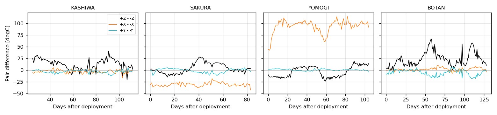

| 衛星 | ΔT_Z 平均 / 標準偏差 [°C] | ΔT_X 平均 / 標準偏差 [°C] | ΔT_Y 平均 / 標準偏差 [°C] | 4側面の最大差の中央値 [°C] |
|---|---:|---:|---:|---:|
| KASHIWA | +12.6 / 11.8 | -2.8 / 3.6 | -2.9 / 3.3 | 4.7 |
| SAKURA | +4.1 / 10.8 | -30.4 / 4.2 | -1.2 / 4.3 | 31.4 |
| YOMOGI | -3.6 / 11.7 | +93.9 / 13.9 | +0.6 / 1.7 | 3.6 |
| BOTAN | +23.3 / 15.3 | +1.6 / 3.3 | -5.2 / 6.4 | 5.5 |

ΔT_X と ΔT_Y の標準偏差は，SAKURAとYOMOGIの+X面を除けば1.7–6.4 °Cである．ΔT_Z の標準偏差10.8–15.3 °Cに対して半分以下であり，側面はZ軸まわりの回転で平均化されていると解釈できる．SAKURAの+X面は全期間で他面より約30 °C低く，YOMOGIの+X面は約94 °C高い．どちらも時間変化が小さい固定偏差であり，姿勢ではなくセンサまたは換算式の問題として扱うべきである．YOMOGIの4側面の最大差3.6 °Cは+X面を除いた値である．

### β角と各面温度

各面の温度をβ角に対して散布図で示す．YOMOGIの+X面は灰色背景で示し，統計から除外した．

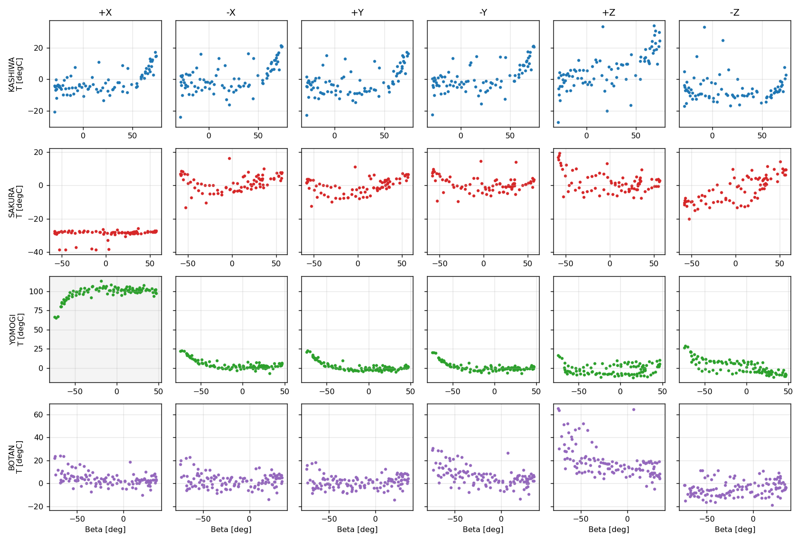

側面の温度は，β角の符号によらず絶対値が大きいほど高い．これは日照率の増加を反映する．全面平均温度と日照率の相関係数は，KASHIWAで0.69，SAKURAで0.36，YOMOGIで0.91，BOTANで0.46である．YOMOGIは放出直後の全日照期間に全面が約20 °Cまで上昇し，その後の食期間に0 °C付近へ下がったため，相関が際立って高い．SAKURAはβ角の絶対値が58°以内で全日照がなく，日照率の変動幅が小さいため相関が低い．

±Z面はβ角の符号で挙動が分かれる．KASHIWAとYOMOGIは+Z面が正のβ角で高温，SAKURAとBOTANは-Z面が正のβ角で高温である．この非対称が前節の極性に対応する．

### 各面の有効α/ε

側面の有効α/εは4機で0.83–1.02に収まり，太陽電池を貼った黒色面の典型値と整合する．誤差棒は四分位範囲の半分である．

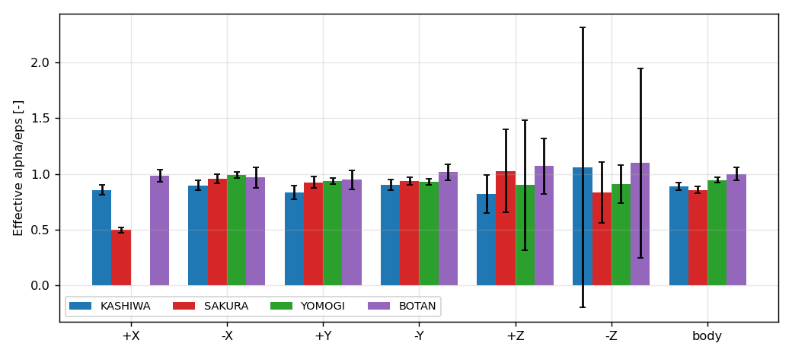

| 衛星 | +X | -X | +Y | -Y | +Z | -Z | 全体 |
|---|---:|---:|---:|---:|---:|---:|---:|
| KASHIWA | 0.86 | 0.90 | 0.83 | 0.90 | 0.82 | 1.06 | 0.89 |
| SAKURA | 0.50 | 0.96 | 0.92 | 0.94 | 1.03 | 0.83 | 0.86 |
| YOMOGI | — | 0.99 | 0.94 | 0.93 | 0.90 | 0.91 | 0.95 |
| BOTAN | 0.98 | 0.97 | 0.95 | 1.02 | 1.07 | 1.10 | 1.00 |

面の材質で見ると，トリプルジャンクション太陽電池の側面（-X，±Y）は0.83–1.02である．FR4基板の+X面はKASHIWAで0.86，BOTANで0.98であり，SAKURAとYOMOGIはセンサの固定偏差のため評価できない．太陽電池面は吸収した太陽光の一部を電力として取り出すため，有効α/εは素材の値より低く出る．変換効率0.28，セル被覆率0.6とすれば低下量は約0.17である．BOTANのCIGS面は1.07で，4機の+Z面のうち最も高い．CIGSはトリプルジャンクションより変換効率が低く，取り出す電力が小さいため，有効α/εは高くなる方向である．ただし±Z面の値は四分位範囲が0.3–2.5と広く，信頼性が低い．Z面の入射量は太陽から離れる期間に0へ近づき，放射平衡式の分母が小さくなるためである．SAKURAの+X面の0.50は温度の固定偏差に起因し，物性値ではない．衛星全体の α/ε は0.86–1.00で，号機間の差は0.15以内である．BOTANは側面も0.95–1.02と他機より高く，全体でも最も高い．

## 生HKによる軌道周期分解の解析

本章では，90秒周期の生HKを用いて，日次データでは区別できなかった磁力線仮説と軌道面法線仮説を判別し，姿勢が安定するまでの時間，スピン速度，α と ε を求める．生HKは `data/downlink/<衛星>/hk/` に収録し，本章の結果は日別の指標と食の一覧に集約して `data/derived/<衛星>/attitude_daily.csv` と `data/derived/<衛星>/eclipse_events.csv` に収録した．解析は `analysis/attitude/attitude_transient.py` で再現できる．

### 生HKと食の検出

生HKは4機とも90秒周期で，SAKURA，YOMOGI，BOTANは放出直後から，KASHIWAは放出後10.6日目から得られる．KASHIWAは41バイト形式の16進ログを復号し，運用チームの評価シートと温度・電圧・電流が一致することを確認した．KASHIWAの時刻は起動後経過時間しかなく，5月7日に再起動して計数が戻っている．起動時刻は，高速HK評価シートに記録された受信時刻と経過時間の差から2024-05-07 11:52 UTCと決めた．

食は，5面の太陽電池電圧がすべて2 V未満の区間とした．日照中の電圧は4.5–5.5 V，食中は1.3–1.4 Vであり，しきい値の選び方に結果は依存しない．食の中心では衛星が軌道面内で反太陽方向にあるため，この時刻から円軌道モデルの位相を決めた．こうして得た位置と，TLE由来の昇交点赤経，IGRF-13から，各HK時刻の ŝ·B̂ を求めた．

| 衛星 | HK件数 | 検出した食 | 位相の残差 RMS | 食の判定一致率 | 食時間 実測 / モデル [分] |
|---|---:|---:|---:|---:|---:|
| KASHIWA | 11,854 | 63 | 2.2° | 98.9% | 27.4 / 28.3 |
| SAKURA | 13,425 | 125 | 2.1° | 99.3% | 32.9 / 33.6 |
| YOMOGI | 18,411 | 150 | 2.8° | 99.2% | 29.1 / 30.0 |
| BOTAN | 15,719 | 139 | 2.7° | 96.0% | 31.5 / 31.6 |

位相の残差は，隣接する食の間で位相を伝播したときのずれである．2–3°は90秒サンプリングによる食中心の不確かさに相当する．食の判定一致率は，モデルの日照とHKの明暗が一致した割合である．食時間の実測とモデルの差は1分以内であり，KASHIWAの起動時刻の推定も含めて時刻とβ角が正しいことを裏付ける．

### 磁力線仮説の判別

Z軸が磁力線に沿っていれば，磁力線は軌道面内で1軌道に2回向きを変えるため，±Z面の温度差 ΔT_Z は ŝ·B̂ に追従して1軌道に2回反転する．軌道面法線に沿う場合はこの変調がない．4機とも整定後は ΔT_Z が ŝ·B̂ に数分の遅れで追従し，日別相関は最大で0.76（KASHIWA），0.95（SAKURA），0.97（YOMOGI），0.98（BOTAN）に達した．

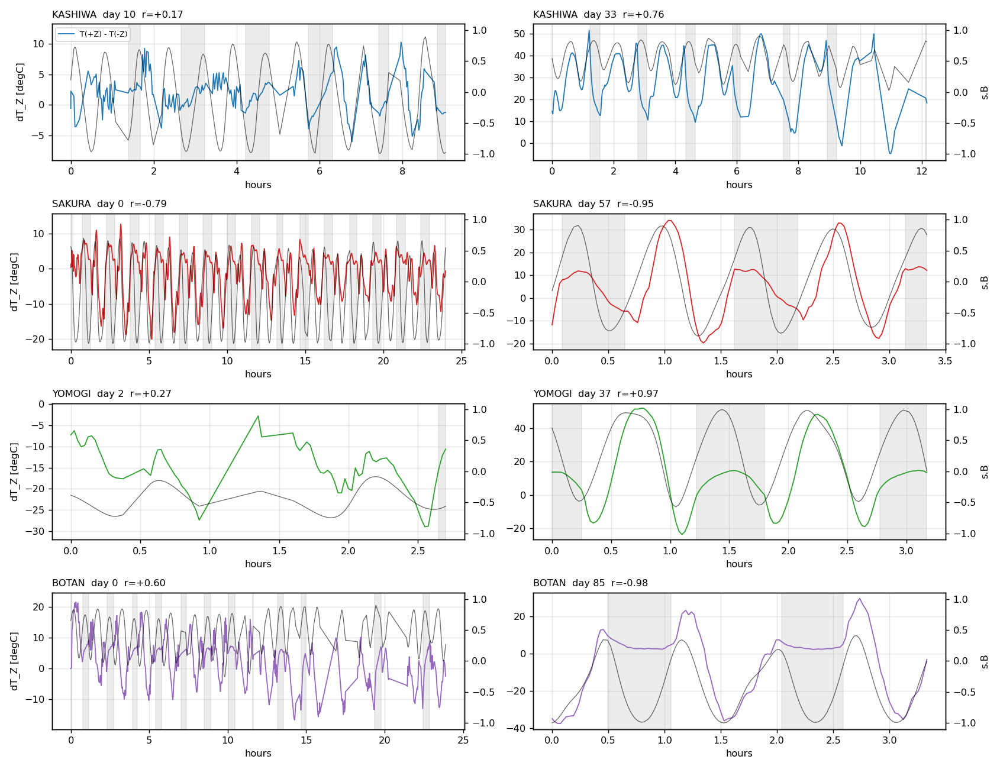

図の左列は最初にモデルと比較できた日，右列は相関が最大の日である．灰色の帯は食を示す．整定後の右列では ΔT_Z が磁力線モデルに追従し，1軌道2回の反転が明瞭である．左列のSAKURAとBOTANは放出当日から追従しているが，速い揺動が重なっている．KASHIWAの10日目とYOMOGIの2日目は追従が弱い．

| 衛星 | 日別相関の中央値 | 四分位範囲 | 遅れ | 極性 |
|---|---:|---:|---:|---|
| KASHIWA | +0.70 | 0.67 – 0.74 | 0–5分 | +Z → +B̂ |
| SAKURA | -0.78 | 0.65 – 0.86 | 0–6分 | +Z → -B̂ |
| YOMOGI | +0.89 | 0.84 – 0.91 | 0–5分 | +Z → +B̂ |
| BOTAN | -0.79 | 0.53 – 0.92 | 0–6分 | +Z → -B̂ |

極性は日次解析と同じである．ただしBOTANは0–10日目に極性が逆（+Z → +B̂）であり，11–13日目に反転して14日目以降は +Z → -B̂ で安定した．109–110日目にも一時的に極性が戻り，111–112日目は相関が0.3未満，113日目以降は再び -B̂ を向いた．KASHIWA，SAKURA，YOMOGIに極性の反転はない．

### 姿勢が安定するまでの時間

安定化は次の2つの指標で評価した．

- 捕捉: 日別相関の絶対値が0.5以上を3日以上続ける．Z軸が平均として磁力線を向いた状態である．
- 整定: 日照中に+Z面と-Z面のどちらが明るいかの切替回数が2回/軌道以下を3日以上続ける．理想的な沿磁力線状態では磁力線の反転に伴う2回だけが残るため，これを超える切替はZ軸の揺動を表す．

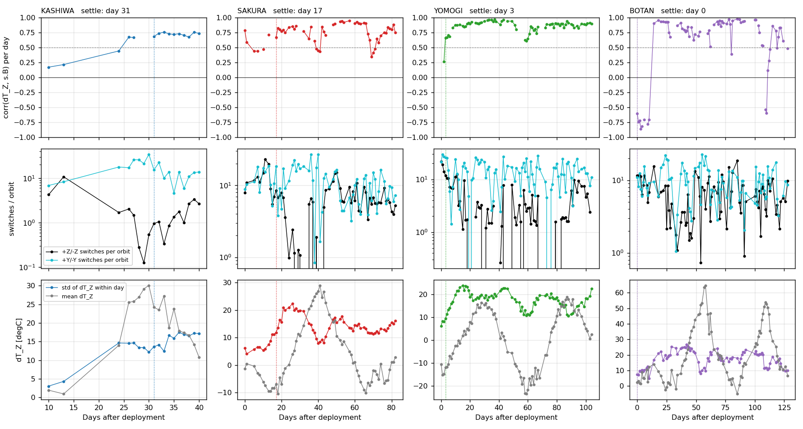

図の上段は日別相関，中段はZ面と±Y面の切替回数，下段は ΔT_Z の日内標準偏差と日平均である．±Y面はZ軸まわりの回転で切替が10–30回/軌道となり，90秒サンプリングでは回転周期を解像できないことを示す．

| 衛星 | 捕捉 | 整定 | 経過 |
|---|---:|---:|---|
| KASHIWA | 26日目以前 | 24日目以前 | 10–13日目は相関0.17–0.63，切替4–12回/軌道で未整定．14–23日目は欠測．24日目以降は相関0.44–0.76，切替2回以下．整定は14–24日目の間である． |
| SAKURA | 13日目 | 24日目 | 0–1日目から相関-0.6〜-0.8で追従するが，5–13日目は-0.4台に低下し，切替は22日目まで8–23回/軌道と多い．運用チームが21日目の会議で「沿磁力線の効果がない可能性」と記録した時期は，追従しつつ大きく揺動していた期間に当たる． |
| YOMOGI | 3日目 | 17日目 | 0–2日目は全日照で食がなく位相を決められないが，切替19–22回/軌道でタンブリングしている．3日目に相関0.67，8日目以降0.84–0.94．切替は6–8日目に7回，12日目に3回，15日目以降1–2回に減った． |
| BOTAN | 0日目 | 判定不能 | 放出当日から相関0.6–0.86だが極性が逆．11–13日目に反転し，14日目以降は-0.9で安定．切替回数は中央値6回/軌道で他機より多いが，+Z面のCIGS太陽電池は電圧特性が異なるため，この指標は使わない． |

整定までの2–3週間は，ヒステリシスダンパで回転エネルギーを散逸させるのに要した時間と解釈できる．BOTANの初期の逆極性は，放出時の回転で+Z軸が磁力線と反平行の向きに保たれ，減衰後に反転したと考えると整合する．

### 指向安定度と収束・減衰

指向安定度は，Z軸と磁力線のなす角の指標 θ_eff で表す．日ごとに ΔT_Z を ŝ·B̂ に回帰した傾き k は，Z軸が磁力線のまわりで揺動すると揺動角の余弦の平均だけ小さくなる．そこで整定後の傾きの90パーセンタイル k_ref を基準に θ_eff = arccos(k / k_ref) と定義した．θ_eff が90°を超える期間は極性が逆であることを表す．傾きは温度感度のβ角依存も含むため，θ_eff の絶対値は目安であり，時間変化を読むための指標である．

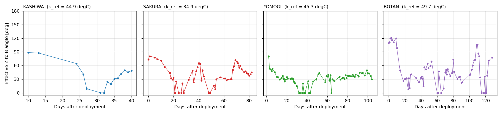

減衰の速さは，θ_eff とZ面の揺動指標に指数関数 y = y∞ + A exp(−t/τ) を当てはめて求めた．揺動指標は，Z面の明暗切替回数から磁力線の反転に伴う2回/軌道を引いた値である．当てはめは放出後70日目までの日別値に対して行った．

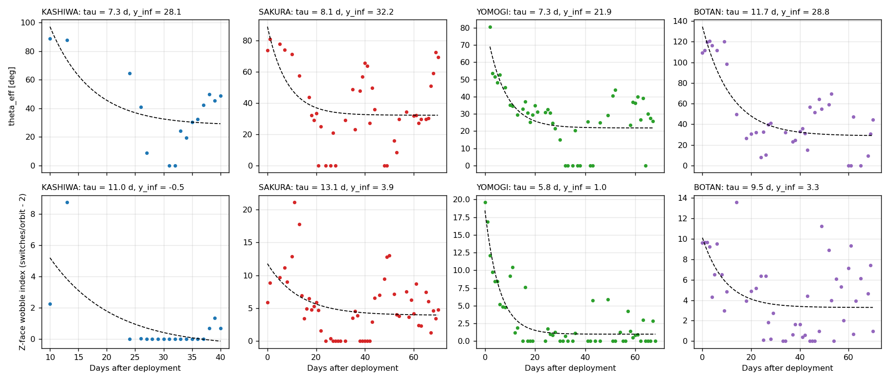

| 衛星 | θ_eff 初期 | θ_eff 整定後 | 時定数 τ（θ_eff） | 時定数 τ（揺動指標） | 収束（過剰分10%） |
|---|---:|---:|---:|---:|---:|
| KASHIWA | 88°（10日目） | 21–45° | 7 ± 7日 | 11 ± 11日 | 27–35日目 |
| SAKURA | 74–81° | 30–52° | 8 ± 5日 | 13 ± 9日 | 19–30日目 |
| YOMOGI | 48–80°（2日目） | 26–39° | 7 ± 3日 | 5.8 ± 0.9日 | 13–19日目 |
| BOTAN | 112°（極性逆） | 29–57° | 12 ± 4日 | 9 ± 6日 | 22–27日目 |

時定数は4機とも6–13日で，ヒステリシスダンパによる回転エネルギーの散逸として同程度である．YOMOGIが最も速く，揺動指標の時定数5.8日で13日目に収束した．KASHIWAは10日目以前のデータがなく，24日目までの欠測もあるため時定数の不確かさが大きい．SAKURAの θ_eff は36–44日目と65–72日目に60–70°へ戻るが，この期間はβ角の絶対値が大きく，Z面が連続して日照を受けて温度感度が下がる時期に当たる．揺動の再増加ではなく指標の限界とみるべきである．BOTANの0–10日目の112°は極性が逆の期間，104–112日目の90°前後は一時的な反転の期間である．

### スピン速度

高速HK（6秒周期）の側面電圧をLomb-Scargle法で周期解析した．Z軸まわりに回転していれば側面の電圧は回転周期で変調し，Z面は変調しない．

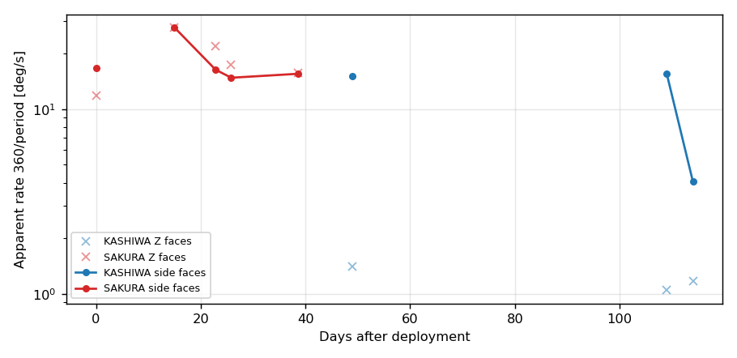

| 衛星 | 経過日 | 側面の周期 | 回転速度 | Z面の変調 | 備考 |
|---|---:|---:|---:|---|---|
| SAKURA | 0日目 | 21.6 s | 16.7 °/s | 強い（30 s，0.45） | Z面も変調しており回転軸はZ軸からずれている |
| SAKURA | 15日目 | ≤13 s | ≥28 °/s | — | サンプリングの限界に達し信頼できない |
| SAKURA | 23日目 | 22.0 s | 16.4 °/s | 中程度（0.23） | |
| SAKURA | 26日目 | 24.4 s | 14.8 °/s | 中程度（0.33） | |
| SAKURA | 39日目 | 23.2 s | 15.5 °/s | 強い（23 s，0.87） | 側面の周期性は最も明瞭（0.96）．Z面も同じ周期で変調 |
| KASHIWA | 49日目 | 23.8 s | 15.1 °/s | 弱い（0.08） | Z軸まわりの回転として最も理想的 |
| KASHIWA | 109日目 | 23.2 s | 15.5 °/s | 弱い（0.20） | |
| KASHIWA | 114日目 | 88.9 s | 4.0 °/s | 弱い（0.07） | 再突入7日前．減速の可能性があるが折返しの可能性も残る |

SAKURAとKASHIWAの回転速度は約23秒周期，15–16 °/sで一致する．運用チームがECAM画像から求めた13–17 °/sと整合する．SAKURAは整定後もZ面が回転周期で変調しており，回転軸がZ軸から傾いている．運用チームが指摘した重心の偏りと整合する．KASHIWAはZ面の変調が弱く，回転軸がZ軸に近い．YOMOGIとBOTANには高速HKがないため評価していない．

### α と ε の分離

定常状態からは α/ε しか決まらないため，食中の冷却率を用いた．各面を1つの熱節点とみなし，次の式を最小二乗で当てはめた．

C_p dT/dt = −ε A (σT⁴ − q_IR F) − G (T − T_bat) + α A (S q_sun + a S F cos z)

ここで T は面温度，T_bat はバッテリ温度で内部の代表温度とし，G は面と内部の熱コンダクタンスである．食中は右辺第3項がなく，ε と G が決まる．日照中は残りから α が決まる．面積 A は0.01 m²，熱容量 C_p はFR4基板と太陽電池の質量から45 J/Kと仮定した．ε と α は C_p に比例するため，値は C_p/45 J/K を掛けて読み替える．α/ε は C_p に依らない．

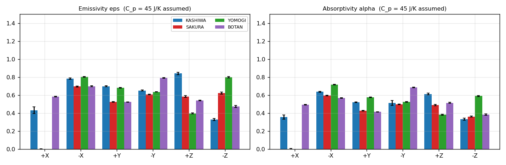

| 衛星 | ε 側面平均 | α 側面平均 | α/ε 過渡 | α/ε 定常 | G [W/K] | 食中の当てはまり R² |
|---|---:|---:|---:|---:|---:|---:|
| KASHIWA | 0.71 | 0.56 | 0.78 | 0.88 | 0.024–0.030 | 0.85–0.88 |
| SAKURA | 0.61 | 0.51 | 0.83 | 0.94 | 0.016–0.027 | 0.76–0.87 |
| YOMOGI | 0.71 | 0.61 | 0.86 | 0.95 | 0.021–0.028 | 0.85–0.89 |
| BOTAN | 0.67 | 0.56 | 0.83 | 0.98 | 0.018–0.029 | 0.77–0.85 |

側面平均は-X，+Y，-Yの3面の平均である．食中の当てはまりは良く，残差は5 mK/s程度である．過渡解析の α/ε は定常解析より10%ほど低いが，独立な2つの方法で同じ傾向を得た．太陽電池面の ε は文献値で0.85前後であるから，得られた0.61–0.71は熱容量が仮定より2–3割大きい，すなわち面の節点が構体の一部を含むことを示す．C_p を55–60 J/Kとすれば ε は0.8–0.9，α は0.65–0.75となり，太陽電池面として妥当である．±Z面と+X面は，Z面の入射が小さい期間があること，および+X面センサの問題により，信頼性が低い．

内部との熱コンダクタンス G は0.02–0.03 W/Kで4機に共通する．食中に面温度が40 °C下がる一方でバッテリ温度の変化が数 °Cにとどまるのは，この弱い結合による．

## 号機ごとの特性

### KASHIWA

HKは25日目以降だけを収録するが，β角が2周期分を含むため検定には十分である．±Z面の温度差はモデルに追従し，+Z面が平均で12.6 °C高い．切片が+7 °Cであるため，+Z面側に内部発熱またはセンサ偏差がある．側面4面は互いに5 °C以内で，4機の中で最も対称性が高い．生HKでは10–13日目に未整定，24日目には整定しており，高速HKの49日目にはZ面の変調が弱い理想的なZ軸まわりの回転（15 °/s）を示す．極性の反転はない．

### SAKURA

磁力線モデルの当てはまりが4機で最も良く，相関係数は-0.78である．β角が-58°に達した41日目にΔT_Zは+28 °Cの極大を示し，モデルの極大と時期が一致する．生HKでは放出当日から磁力線に追従しつつ大きく揺動し，24日目に整定した．回転速度は15–16 °/sで，整定後もZ面が回転周期で変調するため回転軸はZ軸から傾いている．運用チームが指摘した重心の偏りによる傾きと整合する．+X面は全期間で約-29 °Cに固定されている．+X面はアンテナを取り付けたFR4基板であり，生HKでは食中に-38 °C，日照中に-25 °Cと変動幅が他面の3分の1しかない．同じ構成のKASHIWAとBOTANの+X面は他面と同程度であるため，構造ではなくセンサ異常として扱う．

### YOMOGI

放出直後の全日照期間が全面温度を支配し，全面平均温度と日照率の相関は0.91である．ΔT_Z は24–26日目と52–59日目に階段状に変化し，滑らかなモデル曲線から外れる．生HKの日別相関はこの期間も0.8–0.9を保ち極性の反転もないため，Z軸が磁力線から外れたのではない．50–57日目にZ面の切替が3–6回/軌道に増えており，揺動の増加が日平均の段差として現れたと考えられる．整定は最も速く，3日目に捕捉，17日目に整定した．+X面は約+98 °Cで固定偏差があり，統計から除外した．

### BOTAN

+Z面が全期間で高温であり，切片は+18 °C，ΔT_Z の平均は+23 °Cである．β角が-74°に達した57日目にΔT_Zは+66 °Cの極大を示し，モデルの極大と時期が一致する．ただし極大の振幅はモデル回帰直線を20 °C上回り，4機で最大である．+Z面はCIGS太陽電池の面である．HKに含まれるCIGS温度は+Z面温度と相関係数0.986で一致し，平均差は-1.6 °Cである．2つのセンサが一致するため，+Z面の高温はセンサの偏差ではなく実際の温度である．CIGSはトリプルジャンクションより変換効率が低く，吸収した太陽光の多くが熱になる．加えて，薄膜セルと基板の熱結合が弱ければ面温度はさらに上がる．-Y面が+Y面より平均5 °C高い点も他機にはない特徴である．β角は地上局DBに残る237件のTLEに基づき，昇交点赤経の閉合誤差は137日間で-0.14°である．生HKでは0–10日目に極性が逆で，11–13日目にZ軸が磁力線に対して180°反転し，109–110日目にも一時的に反転した．反転が起きた唯一の号機であり，永久磁石の強さと回転エネルギーの関係を確認する価値がある．

## 制約と次の解析

本解析の制約と，優先すべき次の解析を示す．

1. 磁力線仮説は生HKで確定したが，回転軸とZ軸のなす角，および揺動の振幅は求めていない．高速HKのZ面変調の振幅から傾き角を推定できる．
2. 磁石のN/Sの向きが号機間で異なる（KASHIWA・YOMOGIは+ZがN極，SAKURA・BOTANは+ZがS極）．永久磁石の取付方向を組立記録と照合する．
3. SAKURAとYOMOGIの+X面は固定偏差が大きく，+X面だけ異なるリニア型センサの換算式と実装を確認する必要がある．
4. BOTANの+Z面の高温はCIGS太陽電池の温度として2つのセンサで確認できるが，CIGSの吸収率，放射率，熱結合の設計値との比較は未実施である．BOTANのジャイロ記録は16進形式でフォーマット仕様が見つからず，復号していない．仕様が得られれば，11–13日目の反転を直接確認できる．
5. ε と α の絶対値は面の熱容量の仮定に比例する．構体を含めた熱数学モデルで熱容量を決めれば，不確かさを±30%から1割程度に縮められる．

## 再現

日次解析は `analysis/attitude/attitude_analysis.py`，生HKによる軌道周期分解の解析は `analysis/attitude/attitude_transient.py` で再現できる．後者は `data/downlink/<衛星>/hk/` の生HKを読む．依存パッケージは `analysis/requirements.txt` に示す．IGRF-13の計算に `ppigrf` を用い，利用できない環境では傾斜双極子で代用する．出力は次のとおりである．

- `data/derived/<衛星>/beta_daily.csv`: 日別のβ角，日照率，高度，昇交点赤経，各面の入射量．
- `data/derived/00_compare/attitude_summary.csv`: 号機別の統計量．
- `data/derived/00_compare/attitude_alpha_eps.csv`: 面別の有効α/ε．
- `data/derived/<衛星>/attitude_daily.csv`: 日別の磁力線モデル相関，面切替回数，食時間．
- `data/derived/<衛星>/eclipse_events.csv`: HKで検出した食の中心時刻と継続時間．
- `data/derived/00_compare/attitude_transient_summary.csv`, `attitude_spin.csv`, `attitude_alpha_eps_transient.csv`, `attitude_decay.csv`: 生HK解析の統計量．
- `report/attitude/attitude_*.png`: 本稿の図．
