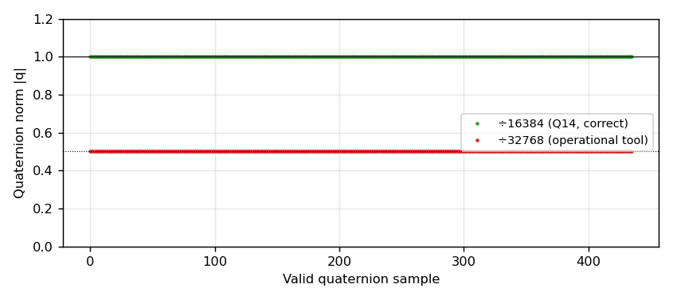

# BOTANジャイロミッションのクォータニオン復元

BOTANは姿勢センサ（IMU）のクォータニオン出力をダウンリンクするジャイロミッションを実施した．本稿は，ダウンリンクフレームからクォータニオンを正しく復元し，運用時の変換ツールにあったスケール誤りを示す．

## 要点

1. クォータニオンの4成分は符号付き16ビット整数の固定小数点（Q14，すなわち 1.0 = 16384）で格納されている．有効な436サンプルすべてで生値の二乗和のルートが16384.0（標準偏差0.3）であり，Q14であることが確認できる．
2. 運用時の変換ツール（`BTN_PROC_246_GYRO_解析ツール.xlsm`）は生値を **32768** で割っていた．その結果クォータニオンのノルムが0.5となり，本来の半分のスケールになっていた．非単位クォータニオンをそのまま回転に用いると姿勢が歪む．運用チームのUnity可視化用CSVでもノルムは0.5003（標準偏差0）であり，この誤りが確認できる．
3. 正しくは **16384** で割る．復元した単位クォータニオンを `data/derived/04_botan/gyro_attitude.csv` に収録した．

図1は有効サンプルのクォータニオンのノルムである．正しい÷16384では1.0に，運用ツールの÷32768では0.5に一致する．

## フレーム構成

ダウンリンクフレームのミッションデータ部は32バイトのレコードの並びである．各レコードはビッグエンディアンで，運用ツールの列ラベルに従うと次の構成である．

| オフセット | 内容 |
|---|---|
| 0 | マーカー 0xD0 |
| 1–2 | サンプル番号 |
| 3–4 | ミッション開始からの時刻（秒） |
| 5–10 | 加速度 X/Y/Z（各int16） |
| 11–18 | クォータニオン i/j/k/実部（各int16，Q14） |
| 19–28 | 太陽電池電流 -X/+Y/-Y/+Z/-Z（ADC生値） |
| 29 | 予約 |
| 30–31 | フッタ 0xF00F |

ダウンリンクコマンドによって，クォータニオンを載せるセッションと加速度を載せるセッションがある．2025-10-28のセッションはクォータニオン欄が全ゼロで，加速度のみを収録している．

## 姿勢と回転速度

クォータニオンが有効な3セッション（2025-10-12の放出直後，10-20，10-23）について，隣接サンプルの相対回転 dq = q₁⁻¹⊗q₂ から機体系の回転速度を求めた．

| セッション | 放出後 | サンプル数 | 回転速度 \|ω\| 中央値 |
|---|---|---:|---:|
| 2025-10-12（放出直後） | 0日 | 28 | 9.5 °/s |
| 2025-10-20 | 10日 | 156 | 15.9 °/s |
| 2025-10-23 | 13日 | 252 | 18.0 °/s |

回転速度はIMUの姿勢融合出力の連続サンプルから求めたもので，機体系での見かけの回転速度である．IMUの取付け方向と衛星の構造軸の対応（取付け行列）は本データからは決まらないため，回転軸を構造軸に対応づけることはしていない．回転速度は放出直後の約10°/sから13日目の約18°/sへ増加している．

## 再現

`analysis/gyro/gyro_analysis.py` で再現できる．入力は `data/downlink/04_botan/gyro/gyro.csv`，出力は `data/derived/04_botan/gyro_attitude.csv` と本稿の図である．
