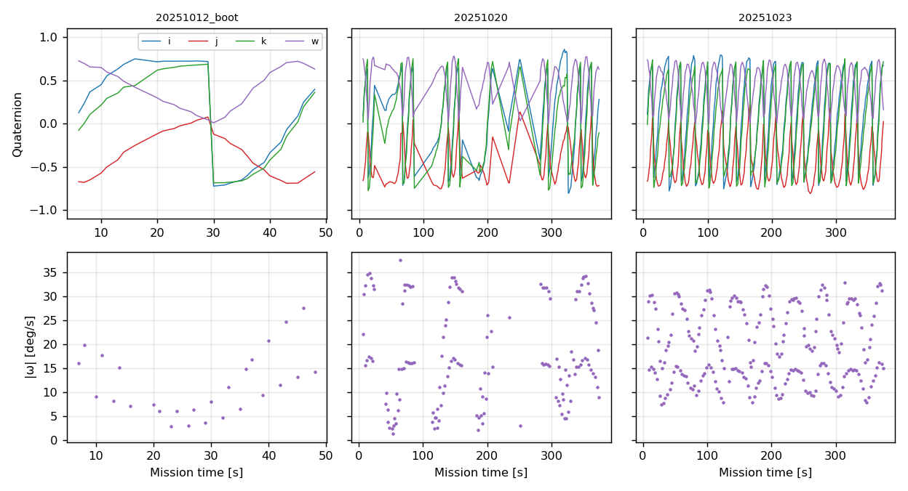
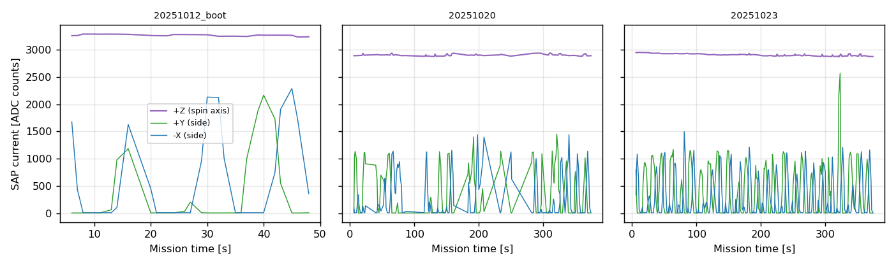

# BOTANジャイロミッションは何を測っているか

BOTANは姿勢センサ（IMU）のクォータニオン出力をダウンリンクするジャイロミッションを実施した．運用ハンドブックによれば，センサは **FSM300**（Arduino R4 clone制御）である．FSM300はBNO085系の9軸IMUモジュールで，加速度計・ジャイロ・**地磁気センサ**を内蔵し，オンボードのセンサフュージョンでクォータニオン（Rotation Vector）を出力する．本稿は，このデータが軌道上で実際に何を測れているのかを検討する．結論を先に述べる．

- **クォータニオンは重力ではなく地磁気を基準にしている．** IMUの絶対姿勢融合は本来，加速度計の重力方向（下）と地磁気の2つを基準に用いる．軌道上は自由落下で加速度計に定常重力がかからないため鉛直基準は失われるが，**地磁気センサは地球磁場という絶対方向を与え続ける**．そのためクォータニオンは地球磁場を基準とする絶対姿勢として意味を持つ（鉛直に対する傾きだけが決まらない）．
- **回転（スピン）は測れる．** クォータニオンの差分から求めた回転速度は約15–18°/sで，機体系のほぼ一定軸（ばらつき5–7°）まわりの単一軸スピンとして整合する．
- **独立な物理量（太陽電池電流）が同じ結論を与える．** SAP電流の変調は，スピン軸が+Z面付近にあり，周期14–16秒（約22–25°/s）で回転していることを示す．IMUと太陽電池という別系統のセンサが整合する．

## クリーンな周期性は地磁気フュージョンの証拠

クォータニオンの各成分は，回転に伴って規則正しく周期変化する（図）．もし融合が絶対基準を失って角速度の積分だけに頼っていれば，姿勢はドリフトし，成分はもとの値に戻らずに流れていくはずである．**周期性が崩れずに現れること自体が，融合が固定した絶対方向の基準を持っている証拠**である．軌道上では加速度計の重力基準が使えないから，その基準は地磁気センサ（地球磁場）でしかありえない．FSM300のRotation Vectorはまさに加速度計・ジャイロ・地磁気を融合した出力であり，重力が使えない環境では地磁気が絶対基準を担う．

これはBOTANの姿勢制御と一貫する．BOTANは永久磁石で+Z面を磁力線に沿わせ，その軸まわりに回転する受動磁気姿勢制御を行う（[姿勢解析](../attitude/attitude.md)）．FSM300が基準とする地磁気は，まさに衛星が姿勢を合わせている当の磁場である．したがってクォータニオンは「磁場に対する衛星の向き」を表し，磁場に沿った軸まわりのスピンが，透明な位相の回転として周期的に現れる．

## 自由落下で測れるもの・測れないもの

地上ではIMUの加速度計が重力（約9.8 m/s²）を「下」として検出し，鉛直基準に用いる．軌道上の衛星は自由落下しており，機体に固定した加速度計にかかる定常加速度は，スピンによる向心加速度 a = ω²r 程度しかない．ω = 20°/s = 0.35 rad/s，スピン軸からの距離 r ≈ 0.05 m とすると a ≈ 0.006 m/s²（約0.6ミリG）で，しかも向きは機体とともに回る半径方向である．固定した鉛直基準にはならない．したがって融合が出力する姿勢のうち，**鉛直（地球中心方向）に対する傾きは決まらない**．一方，**地磁気に対する向きは地磁気センサで決まり，回転（スピン）はジャイロで直接測れる**．

角速度に基準の運動は要らない．位置や速度は相対量なので基準を決めないと意味を持たないが，回転は慣性空間に対する絶対量であり，レートジャイロ（コリオリ力を測るMEMSセンサ）は外部基準なしにこれを計測する．深宇宙でもジャイロで角速度を測れるのはこのためである．

本稿の回転速度は，生のジャイロ出力そのものではなく融合クォータニオンの差分 dq = q₁⁻¹⊗q₂ から求めている．差分を取ると絶対姿勢のオフセットは打ち消され，1サンプル間の姿勢変化が残る．各セッションで瞬間回転軸（wx,wy,wz の向き）は機体系のほぼ一定方向（およそ (0.98, 0.17, 0.0)）に集まり，平均軸まわりのばらつきの中央値は5–7°である．単一軸まわりの一貫した回転が得られていることは，差分が実際のスピンを捉えていることを示す．回転速度は放出直後で約9.5°/s，10日目で約16°/s，13日目で約18°/sであった．

## 太陽電池電流による独立検証

姿勢に依存する別の物理量として，5面の太陽電池（SAP）電流がフレームに含まれている．スピンしていれば，スピン軸の面は太陽を向いたまま定常に発電し，側面は回転に応じて明暗を繰り返す．

図のとおり，全セッションで**+Z面の電流はほぼ一定**（変動係数0.006–0.008，1%未満）であり，**側面（+Y，−X）は0から最大まで大きく変調**する（変動係数1.3–1.5）．+Yと−Xは約90°位相がずれており，機体が+Z軸まわりに回転していることを示す．側面電流のスペクトルから求めたスピン周期は14–16秒（約22–25°/s）で，クォータニオンから求めた回転速度と同程度である．すなわち，スピン軸は+Z面付近，スピン速度は十数°/sというのは，IMUと太陽電池の双方が支持する結論である．

放出直後（2025-10-12）のセッションでは側面の変調周期が長く（約20秒），スピンが遅い．10日後・13日後には変調が速くなり，スピンが増速している．これは回転速度の増加と整合する．

この結果は，日次HKと軌道要素による [姿勢解析](../attitude/attitude.md) の結論（BOTANは+Z面を磁力線に沿わせてZ軸まわりに回転する）を，軌道上のスピン速度の直接計測として裏づける．姿勢解析ではBOTANのスピンは+Z面のCIGS電圧から評価できなかったが，ジャイロミッションと側面SAP電流がこれを補う．

### 周期は自転か，地球周回か

周期性の出所を確かめるため，2025-10-23のスピン周期を地球周回の周期と比べる．同日のTLE（平均運動15.526回/日）から軌道周期は5565秒（92.75分）である．一方，このセッションのスピン周期は14–20秒で，軌道周期の約1/280–1/380しかない．すなわち1周回のあいだに数百回自転している．セッション長は370秒で1周回の6.6%にすぎず，軌道周期の変化（地磁気方向の周回変動を含む）はこの短い区間には現れない．したがってクォータニオンに見える周期は衛星自身の自転であり，地球周回に由来するものではない．

## 放出直後の飛びは特異点か，実際の姿勢変化か

放出直後（2025-10-12）のセッションでは，t≈30秒でクォータニオンの成分が一斉に飛ぶ（[図](gyro_quaternion.png)の左パネル）．これは実際の姿勢変化ではなく，クォータニオンの二重被覆（q と −q は同一姿勢を表す）による符号反転である．反転の直前と直後の値は q₁₆ = (0.72, 0.08, 0.69, 0.05)，q₁₇ = (−0.72, −0.12, −0.68, 0.01) で，q₁₆ と −q₁₇ の内積は0.998（両者の姿勢差はわずか4°）である．この間の実際の回転は約8°/sで，前後の自転速度と変わらない．符号反転はスカラー部 qw がゼロを横切る t=30秒の1点だけで起こり，これがグラフの不連続の唯一の原因である．

このことは，クォータニオンから姿勢を復元したキューブのアニメーション（`report/gyro/gyro_boot_animation.mp4`）で可視化できる．符号を連続に補正するとキューブは滑らかに回り続け（実姿勢は連続），生値の成分グラフだけが t=30秒で飛ぶ．すなわち不連続は表示上の特異点である．アニメーションは `analysis/gyro/gyro_animation.py` で生成する．

## クォータニオンの復元とスケール誤り

クォータニオンの4成分は符号付き16ビット整数の固定小数点（Q14，すなわち 1.0 = 16384）で格納されている．有効な436サンプルすべてで生値の二乗和のルートが16384.0（標準偏差0.3）であり，Q14であることが確認できる．

運用時の変換ツール（`BTN_PROC_246_GYRO_解析ツール.xlsm`）は生値を **32768** で割っていた．その結果クォータニオンのノルムが0.5となり，本来の半分のスケールになっていた．運用チームのUnity可視化用CSVでもノルムは0.5003（標準偏差0）であり，この誤りが確認できる．非単位クォータニオンをそのまま回転に用いると姿勢は歪む．正しくは **16384** で割る．復元した単位クォータニオンと回転速度を `data/derived/04_botan/gyro_attitude.csv` に収録した．

## フレーム構成

ダウンリンクフレームのミッションデータ部は32バイトのレコードの並びである．各レコードはビッグエンディアンで，運用ツールの列ラベルに従うと次の構成である．

| オフセット | 内容 |
|---|---|
| 0 | マーカー 0xD0 |
| 1–2 | サンプル番号 |
| 3–4 | ミッション開始からの時刻（秒） |
| 5–10 | 加速度 X/Y/Z（各int16） |
| 11–18 | クォータニオン i/j/k/実部（各int16，Q14） |
| 19–28 | 太陽電池電流 -X/+Y/-Y/+Z/-Z（ADC生値） |
| 29 | 予約 |
| 30–31 | フッタ 0xF00F |

ダウンリンクコマンドによって，クォータニオンを載せるセッションと加速度を載せるセッションがある．2025-10-28のセッションはクォータニオン欄が全ゼロで加速度のみを収録しているが，SAP電流は同様に+Z定常・側面変調を示す．

## 再現

`analysis/gyro/gyro_analysis.py` で再現できる．入力は `data/downlink/04_botan/gyro/gyro.csv`，出力は `data/derived/04_botan/gyro_attitude.csv` と本稿の図である．
