# 衛星運用

KASHIWA，SAKURA，YOMOGI，BOTANの運用期間，軌道高度，HK，軌道上画像を公開用に整理した．内部文書，個人情報を含み得る原本，解析ブック，処理途中の赤グリッド画像は収録していない．

## 概要

運用開始は国際宇宙ステーション（ISS）からの放出時刻とした．運用終了は停波措置を実施したパスの可視開始時刻（acquisition of signal: AOS）とした．終了時刻はコマンド送信時刻ではない．

| 衛星 | 運用開始 | 停波パス | 期間 |
|---|---:|---:|---:|
| KASHIWA | 2024-04-11 10:41 UTC 2024-04-11 19:41 JST | 2024-08-05 14:59 JST | 115.8日 |
| SAKURA | 2024-08-29 09:45 UTC 2024-08-29 18:45 JST | 2024-11-21 21:30 JST | 84.1日 |
| YOMOGI | 2024-12-09 11:15 UTC 2024-12-09 20:15 JST | 2025-03-25 12:57 JST | 105.7日 |
| BOTAN | 2025-10-10 09:50:58 UTC 2025-10-10 18:50:58 JST | 2026-02-27，時刻未確認 | 約140日 |

保存記録から，4衛星とも停波措置の実施を確認した．公開用データには確認元の内部文書を含めない．BOTANの開始時刻は最初のHK時刻，終了日は公開済みの停波日による．

## 軌道

衛星別CSVには，二行軌道要素（two-line element: TLE）から整理した日時，遠地点高度，近地点高度，離心率，放出後日数を収録した．最初の高度は，放出直後ではなく数値を記録した最初のTLEに基づく．BOTANはカタログ番号65942のTLEだけを採用した．

| 衛星 | TLE件数 | 最初の記録 | 最初の近地点 | 300 km以下 | 最後の記録 | 最後の近地点 |
|---|---:|---:|---:|---:|---:|---:|
| KASHIWA | 222 | 2024-04-12 23:37 UTC | 411.2 km | 2024-07-27 21:26 UTC | 2024-08-10 19:36 UTC | 197.4 km |
| SAKURA | 163 | 2024-09-03 14:27 UTC | 404.7 km | 2024-11-16 01:04 UTC | 2024-11-29 00:22 UTC | 174.2 km |
| YOMOGI | 168 | 2024-12-12 16:02 UTC | 404.7 km | 記録なし | 2025-03-17 17:04 UTC | 304.0 km |
| BOTAN | 229 | 2025-10-16 20:12 UTC | 410.2 km | 2026-02-15 06:18 UTC | 2026-03-03 07:18 UTC | 201.2 km |

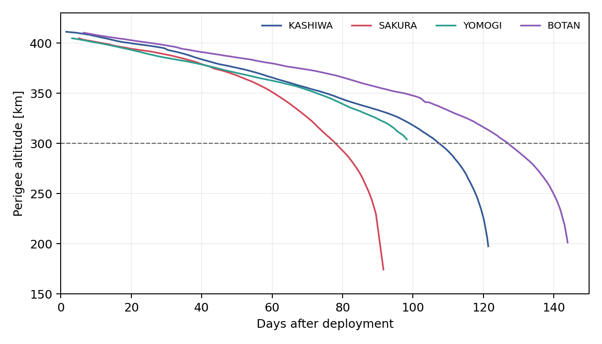

KASHIWA，SAKURA，BOTANは，記録期間内に近地点高度300 kmを下回った．YOMOGIは304 kmまでを収録する．BOTANの軌道CSVは停波後の2026年3月3日までを含む．再突入日を確定するには，末期TLEまたは公的な再突入記録が必要である．

## HK

4衛星すべてで時系列HKを確認できた．衛星別の図は各衛星の時間変化，比較図は共通するバッテリー電圧と温度を同じ軸で示す．KASHIWAの集約ブックは温度だけを収録するため，バッテリー電圧の比較には含めない．表の値は最小値，中央値，最大値の順である．

| 衛星 | 件数 | 期間 | バッテリー電圧 | バッテリー温度 |
|---|---:|---:|---:|---:|
| KASHIWA | 9,413 | 2024-05-06–2024-08-02 JST | — | -1.4 / 8.0 / 24.0 °C |
| SAKURA | 13,443 | 経過83日19時間16分 | 3.867 / 4.254 / 4.280 V | -0.5 / 3.9 / 25.3 °C |
| YOMOGI | 18,411 | 2024-12-09–2025-03-24 JST | 3.890 / 4.230 / 4.250 V | 1.1 / 7.3 / 31.8 °C |
| BOTAN | 15,719 | 2025-10-10–2026-02-16 JST | 3.560 / 4.250 / 4.280 V | 3.5 / 9.1 / 34.5 °C |

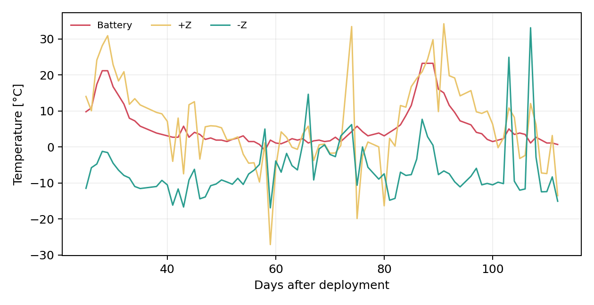

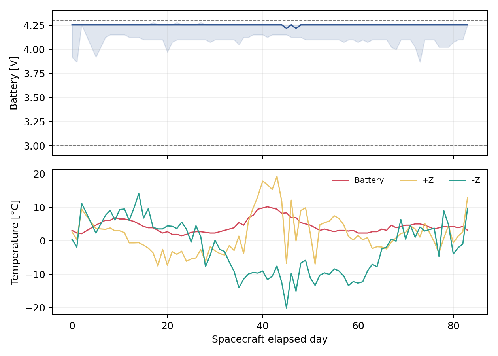

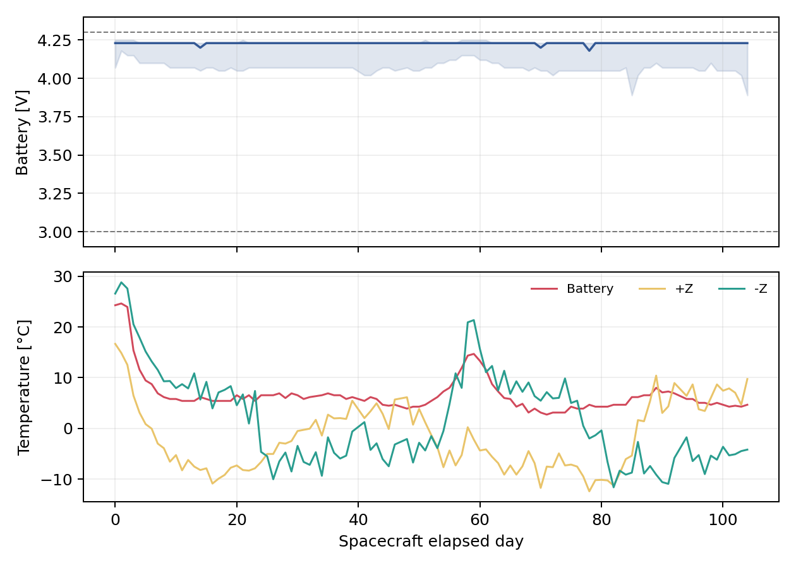

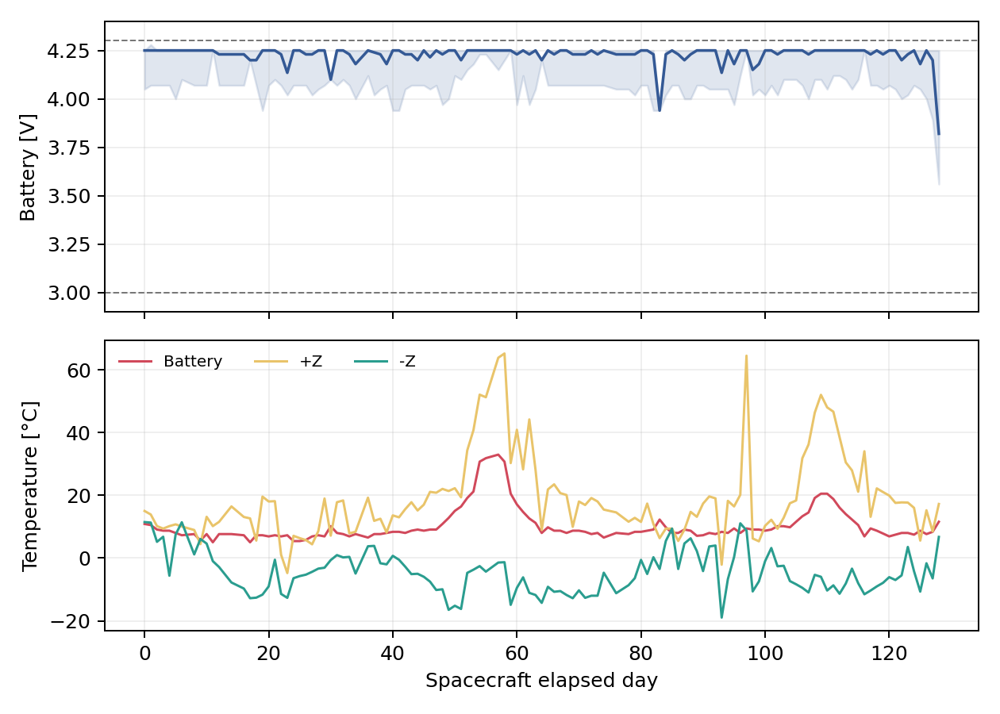

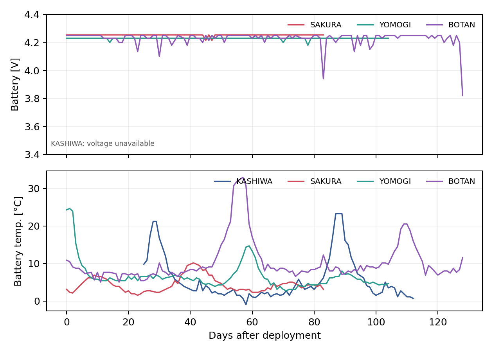

### 外面パネル温度

外面パネル温度は，6面の日別中央値を衛星別と衛星間比較に分けた．±X，±Y，±Zを同じ組合せで示すため，面ごとの温度差と時間変化を確認できる．

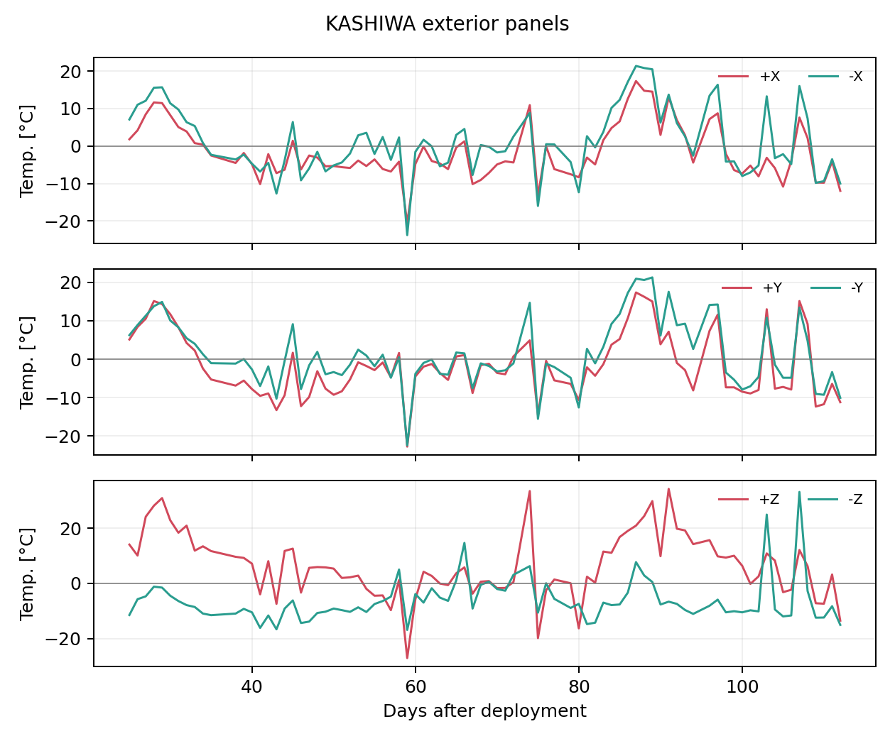

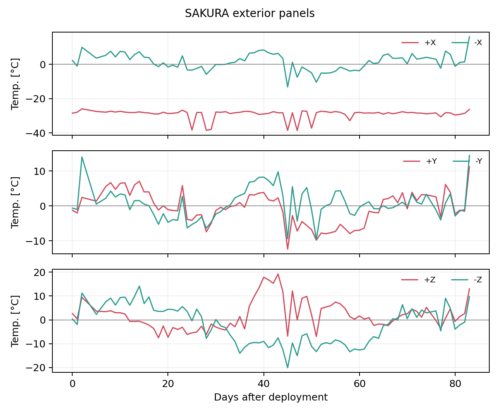

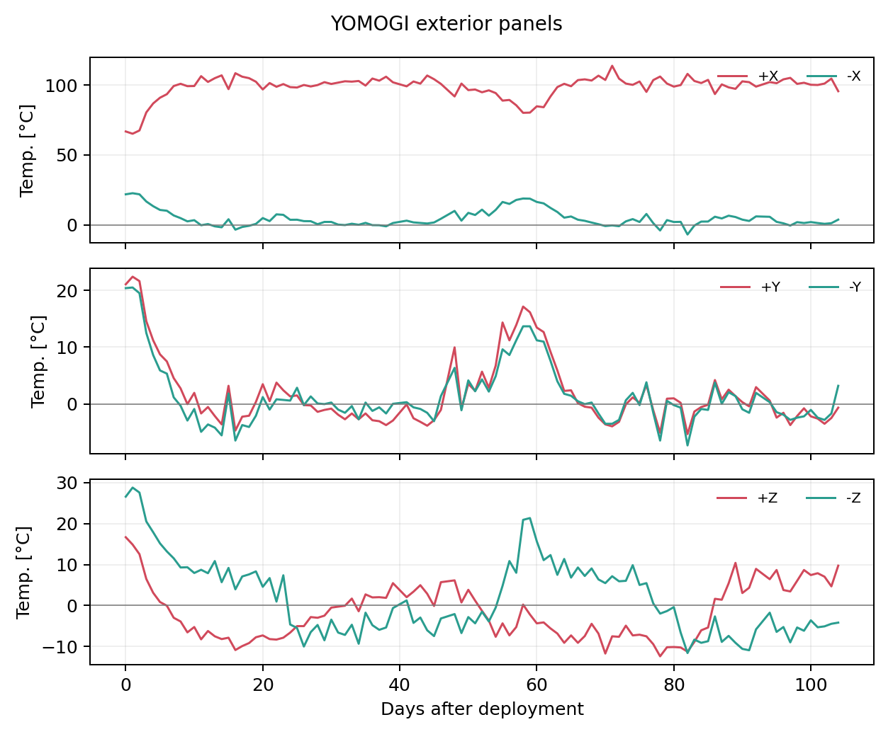

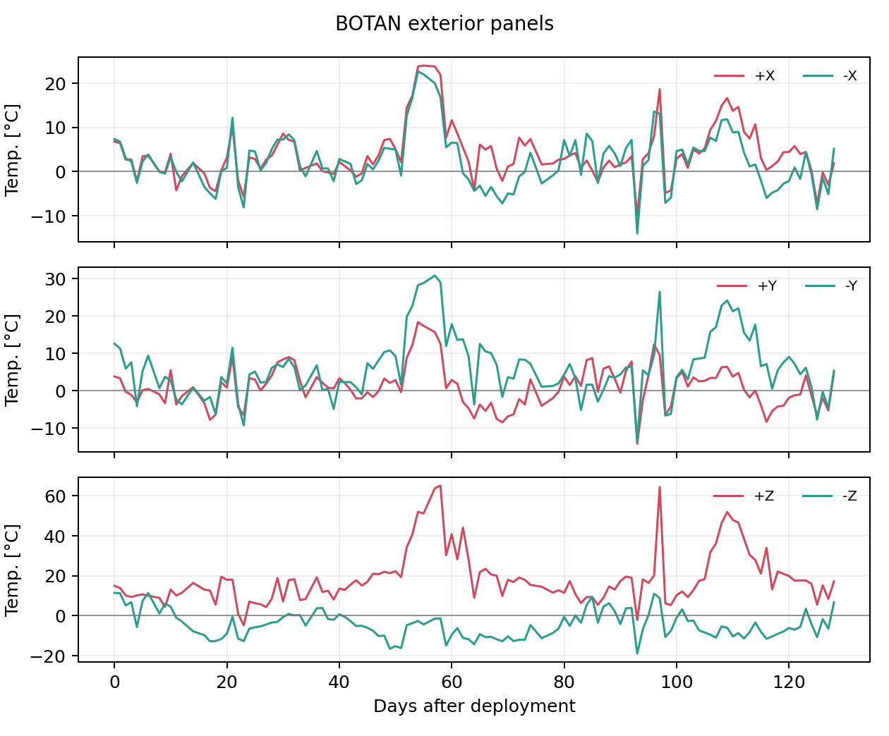

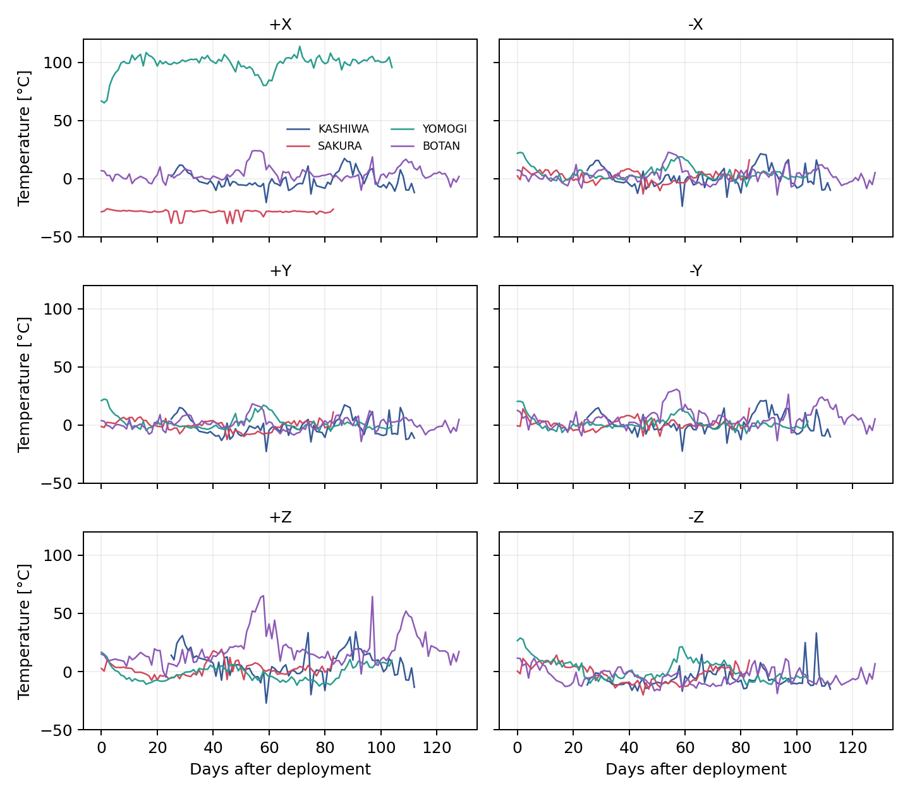

YOMOGIの+X面の日別中央値は65.1–113.7 °Cである．ほかの5面は-12.4–28.8 °Cであるため，温度場の解釈より先に，換算式，校正値，センサ状態を確認する必要がある．値は異常候補として除外せずに収録した．

KASHIWAは時刻有効9,410件に同一時刻15件，時刻逆行8件を含む．SAKURAは同一時刻18件，時刻逆行14件を含む．YOMOGIは全期間の並べ替え済みデータ18,411件を採用した．時刻はすべて有効かつ一意で，逆行もない．+Z面と-Z面は非数値の1件ずつを集計から除外した．BOTANの時刻は15,719件すべて一意で，逆行もない．

YOMOGIは，更新された運用記録にある電流補正済みの全期間データへ置換した．バッテリー電流の中央値は，補正前の0.4082 Aから0.0082 Aへ変わった．公開用の日次値も補正後の値に基づく．

SAKURA，YOMOGI，BOTANのバッテリー電圧は3.0–4.3 Vに入る．SAKURAの電源電圧は2,088件（15.5%）が4.0 Vを下回る．日照，ミッション状態，充放電方向で変化するため，しきい値だけでは故障と判定しない．

生HK（90秒周期）は `data/downlink/<衛星>/hk/hk.csv` に収録した（KASHIWA・SAKURAは高速HKも含む）．日次の要約として，[KASHIWA日次HK](../../data/derived/01_kashiwa/hk_daily.csv)，[SAKURA日次HK](../../data/derived/02_sakura/hk_daily.csv)，[YOMOGI日次HK](../../data/derived/03_yomogi/hk_daily.csv)，[BOTAN日次HK](../../data/derived/04_botan/hk_daily.csv)を収録した．

## 地上局

BOTANのSupabase地上局ログから，日時だけを用いて日次件数を集計した．ダウンリンクは64,409件，111日で記録された．このうちAPRSは7,858件，59日で記録された．期間は2025年10月12日20:26 UTCから2026年2月27日20:46 UTCである．

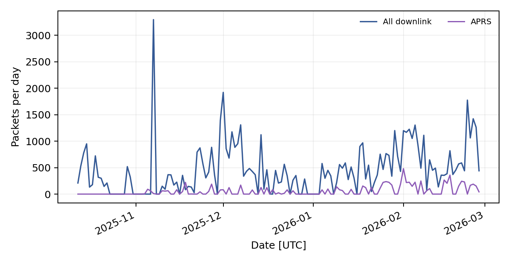

[日次件数](../../data/derived/04_botan/downlink_daily.csv)には日付，総ダウンリンク件数，APRS件数だけを収録した．生パケット，レコードID，パスID，地上局座標，Supabase設定は収録していない．件数は受信成功数であり，受信率ではない．受信率には可視時間と全送信数が必要である．

## 画像

内容が完全に同じ画像と処理途中画像を除き，軌道上画像候補379点を改名して収録した．ファイル名は撮影開始日時（JST，分まで）とSHA-256の先頭10桁で `<衛星またはミッション>_<yyyymmdd>T<hhmm>_<ハッシュ>` に統一した．撮影を特定できない1点は日時を `unknown` とした．読込み不能な4点も，回収・復元の対象として保持した．YOMOGIの更新された運用記録から，AKS・AFR計121点を追加した．赤グリッド6点，位置確認枠2点，画面キャプチャ，試験画像，放出前画像は含めない．

| 分類 | 画像数 | 一覧 |
|---|---:|---|
| KASHIWA CAM | 104 | [view](images_kashiwa.jpg) |
| SAKURA ECAM | 85 | [view](images_sakura_ecam.jpg) |
| SAKURA SCAM | 11 | [view](images_sakura_scam.jpg) |
| YOMOGI AKS | 78 | [view](images_yomogi_aks.jpg) |
| YOMOGI AFR | 43 | [view](images_yomogi_afr.jpg) |
| BOTAN CORN | 37 | [view](images_botan.jpg) |
| BOTAN AURORA | 11 | [view](images_botan.jpg) |
| BOTAN PUMICE | 10 | [view](images_botan.jpg) |

BOTANの旧画像3点のうち1点はCORNと完全一致した．残る2点は同じ取得元であるためCORNへ統合した．自動品質検査では，平均輝度20未満を45点，輝度の標準偏差10未満を11点検出した．暗い宇宙画像と復元失敗画像を含むため，目視確認の優先順位として扱う．寸法，輝度，状態，SHA-256は `data/downlink/<衛星>/images.csv` に示す．

撮影時刻と撮影条件は，運用スケジュール，運用日報，地上局送信ログ，衛星内イベントログから復元し，同じ `images.csv` の `capture_start`，`capture_end`，`iso`，`shutter`，`exposure_mode` などの列に付与した．撮影時刻は378点に範囲で示し，幅は2〜18分である．ISO感度とシャッター速度をコマンドで指定したのはBOTANだけで，SAKURAとYOMOGIはオート露出，KASHIWAはプリセット3種類である．導出方法と号機ごとの結果は [image_capture.md](image_capture.md) に示す．

## 姿勢解析

沿磁力線制御の成立性，β角との相関，各面の有効α/ε，号機ごとの特性は，[attitude.md](../attitude/attitude.md) に示す．β角と各面の入射量は，`data/derived/<衛星>/beta_daily.csv` に収録した．

## 解析案

次の順序で解析すると，運用状態を異常と誤認しにくい．

1. 地上受信時刻，衛星内経過時刻，メモリアドレスを統合する．再起動，重複，欠測を明示する．
2. 日照，食，通信，カメラ，APRS，停波の状態をHKへ付与する．状態別の中央値と中央絶対偏差を基準にする．
3. バッテリー電圧，バッテリー電流，太陽電池電流から充放電収支を求め，日ごとの変化を追う．
4. 温度の換算式，センサ範囲，既知の固定値を確認する．YOMOGIの+X面は，ほかの面との相関を求める前にこの確認を行う．
5. TLEからβ角と食時間を求め，面温度の振幅，極値，位相差との関係を調べる．日次中央値による解析は [attitude.md](../attitude/attitude.md) で実施済みである．
6. ±面の温度差，6面の最大差，軌道周期ごとの振幅を求める．周期と位相が徐々に変わる場合は，姿勢変化またはタンブリング候補として調べる．
7. 移動中央値，変化点検出，主成分分析で異常候補を絞り，コマンド履歴と照合する．
8. 近地点高度の減衰率をロバスト回帰で求める．F10.7とKpを説明変数に加え，予測区間を示す．
9. 画像を知覚ハッシュ，ぼけ，輝度，欠損行で分類する．その後，フラットフィールド補正，地球縁抽出，パノラマ合成を試す．
10. APRSを日次件数，匿名化した送信元，ペイロード種別で集計する．可視時間を分母に加え，仰角別受信率を求める．

最優先は1と2である．時刻と運用状態を整理せずに異常検出を行うと，再起動，食，ミッション実行を異常と誤認しやすい．

## 構成

- `data/downlink/<衛星>/`: 衛星からダウンリンクしたデータ．生HK（`hk/`）と画像（`images/`．YOMOGIはAKS・AFR，BOTANはCORN等）．
- `data/recorded/<衛星>/`: 地上で記録したデータ．TLE取得履歴（`tle.csv`：地上局DB・運用ログ・n2yo）．
- `data/derived/<衛星>/`: 日次HK，軌道高度，姿勢解析の表などの2次データ．号機間比較は `data/derived/00_compare/`．
- `analysis/attitude/`: 姿勢解析のスクリプト．
- `report/operations/`: 本文，簡潔な図，画像一覧，撮影条件の導出．
- `report/attitude/`: 姿勢解析の報告と図．

## 制約

`date` 列とファイル名の日時は運用記録から復元した撮影日であり，元のダウンリンク・復元日は `downlink_date` 列に残した．KASHIWA画像1点は撮影を特定できず，KASHIWAの日中・夜間プリセット77点はISO感度とシャッター速度を数値化できない．ダウンリンク元のフォルダと撮影コマンドのミッションが食い違ったBOTAN 4点とYOMOGI 2点は，撮影コマンド側のミッションへ改名した．終了時刻は対象パスのAOSであり，停波コマンドの送信時刻ではない．BOTANの終了時刻は確認できていない．HKのしきい値超過は異常候補であり，故障を意味しない．
